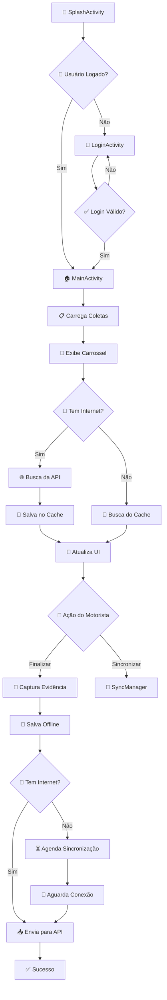

# 🚛 Zylogi Motoristas - Documentação Técnica Completa

*Uma jornada épica através do código: Do login à entrega, passando pelo offline!* 🎮

## 📋 Índice

1. [Visão Geral](#-visão-geral)
2. [Arquitetura do Sistema](#-arquitetura-do-sistema)
3. [Estrutura do Projeto](#-estrutura-do-projeto)
4. [Fluxo de Funcionamento](#-fluxo-de-funcionamento)
5. [Sistema Offline](#-sistema-offline)
6. [Componentes Principais](#-componentes-principais)
7. [Interface do Usuário](#-interface-do-usuário)
8. [Segurança e Autenticação](#-segurança-e-autenticação)
9. [Configurações e Dependências](#-configurações-e-dependências)
10. [Guia de Desenvolvimento](#-guia-de-desenvolvimento)

---

## 🎯 Visão Geral

O **Zylogi Motoristas** é um aplicativo Android nativo desenvolvido para motoristas de entrega, permitindo o gerenciamento completo de coletas e entregas com funcionalidade offline robusta. É como um GPS para a vida profissional dos motoristas! 🗺️

### 🌟 Características Principais

- **📱 Interface Intuitiva**: Design moderno com Material Design
- **🔄 Sincronização Offline**: Funciona mesmo sem internet
- **📍 Geolocalização**: Tracking automático de localização
- **📸 Captura de Evidências**: Fotos para comprovação de entregas
- **🔐 Autenticação Segura**: JWT + Biometria
- **⚡ Performance**: Carregamento rápido com cache inteligente

---

## 🏗️ Arquitetura do Sistema

### 🎭 Padrão Arquitetural: MVVM (Model-View-ViewModel)

```
┌─────────────────┐    ┌─────────────────┐    ┌─────────────────┐
│      VIEW       │◄──►│   VIEWMODEL     │◄──►│     MODEL       │
│   (Activities)  │    │  (MainViewModel)│    │ (API + Database)│
│   (Fragments)   │    │ (LoginViewModel)│    │  (Repositories) │
└─────────────────┘    └─────────────────┘    └─────────────────┘
```

### 🧩 Camadas da Aplicação

1. **🎨 Presentation Layer** (UI)
   - Activities e Fragments
   - Adapters para RecyclerView
   - Custom Views

2. **🧠 Business Logic Layer** (ViewModels)
   - MainViewModel: Gerencia coletas
   - LoginViewModel: Gerencia autenticação

3. **💾 Data Layer**
   - API Service (Retrofit)
   - Room Database (Offline)
   - Repositories (Abstração de dados)

---

## 📁 Estrutura do Projeto

```
com.example.zylogi_motoristas/
├── 🏠 Activities/
│   ├── SplashActivity.java      # Tela de carregamento
│   ├── LoginActivity.java       # Autenticação
│   ├── MainActivity.java        # Tela principal
│   └── DebugActivity.java       # Ferramentas de debug
│
├── 🧠 ViewModels/
│   ├── MainViewModel.java       # Lógica principal
│   └── LoginViewModel.java      # Lógica de login
│
├── 🌐 Network/
│   ├── ApiService.java          # Endpoints da API
│   ├── RetrofitClient.java      # Configuração HTTP
│   └── AuthInterceptor.java     # Interceptador JWT
│
├── 💾 offline/
│   ├── OfflineDatabase.java     # Banco Room
│   ├── OfflineRepository.java   # Repositório offline
│   ├── SyncManager.java         # Sincronização
│   ├── ConnectivityManager.java # Monitor de rede
│   ├── Entities/                # Entidades do banco
│   └── DAOs/                    # Data Access Objects
│
├── 🎨 UI/
│   ├── PickupAdapter.java       # Adapter do carrossel
│   ├── FinalizePickupDialog.java# Dialog de finalização
│   └── OfflineStatusView.java   # Indicador offline
│
├── 🔐 Auth/
│   ├── AuthSessionManager.java  # Gerenciador de sessão
│   └── SessionManager.java      # Persistência de dados
│
└── 📦 Models/
    ├── Pickup.java              # Modelo de coleta
    ├── Occurrence.java          # Modelo de ocorrência
    ├── Client.java              # Modelo de cliente
    └── ...
```

---

## 🎬 Fluxo de Funcionamento

### 🚀 Jornada do Usuário



### 🎯 Ciclo de Vida das Coletas

1. **📥 Recebimento**: Coletas chegam via API
2. **💾 Armazenamento**: Salvas no cache local
3. **📱 Exibição**: Mostradas no carrossel
4. **🚚 Execução**: Motorista realiza a coleta
5. **📸 Evidência**: Captura fotos/dados
6. **💾 Persistência**: Salva offline primeiro
7. **📤 Sincronização**: Envia quando há conexão
8. **✅ Confirmação**: Atualiza status

---

## 🔄 Sistema Offline

### 🧙‍♂️ A Magia por Trás das Cortinas

O sistema offline é o coração do aplicativo, garantindo que os motoristas nunca percam dados, mesmo em áreas sem sinal! 🏔️

#### 🏗️ Componentes do Sistema Offline

```
┌─────────────────────────────────────────────────────────────┐
│                    🔄 SISTEMA OFFLINE                       │
├─────────────────────────────────────────────────────────────┤
│  📡 ConnectivityManager  │  💾 OfflineDatabase              │
│  ├─ Monitor de rede      │  ├─ Room Database                │
│  ├─ Callbacks de status  │  ├─ Entidades (Pickup, etc.)    │
│  └─ Auto-reconexão       │  └─ DAOs para acesso            │
├─────────────────────────────────────────────────────────────┤
│  🔄 SyncManager          │  📦 OfflineRepository            │
│  ├─ WorkManager          │  ├─ Abstração de dados          │
│  ├─ Sincronização auto   │  ├─ Cache inteligente           │
│  └─ Retry automático     │  └─ Fallback strategies         │
└─────────────────────────────────────────────────────────────┘
```

#### 🎯 Estratégias de Cache

1. **📥 Cache-First**: Sempre tenta buscar do cache primeiro
2. **🌐 Network-Fallback**: Se cache vazio, busca da API
3. **💾 Write-Through**: Escreve no cache e API simultaneamente
4. **⏳ Eventual Consistency**: Sincroniza quando possível

#### 🔄 Sincronização Inteligente

```java
// Exemplo de sincronização automática
SyncManager syncManager = SyncManager.getInstance(context);

// Detecta conexão e sincroniza automaticamente
syncManager.addSyncListener(new SyncListener() {
    @Override
    public void onSyncCompleted(int syncedCount, int failedCount) {
        // Atualiza UI após sincronização
        updateUI();
    }
});
```

---

## 🧩 Componentes Principais

### 🏠 MainActivity - O Centro de Comando

**Responsabilidades:**
- 🎠 Gerencia o carrossel de coletas
- 📍 Atualiza localização em tempo real
- 🔄 Coordena sincronização
- 📸 Gerencia captura de evidências

**Características Especiais:**
- ⏰ Atualização de tempo em tempo real
- 🌡️ Exibição de temperatura (futuro)
- 📊 Indicador de progresso das coletas
- 🔄 Pull-to-refresh para atualizar dados

### 🧠 MainViewModel - O Cérebro

**Funções Principais:**
```java
// Busca coletas (online/offline)
public void fetchPickups()

// Finaliza coleta com evidências
public void finalizePickup(String pickupId, Bitmap photo, String occurrence)

// Carrega e cacheia ocorrências
public void loadAndCacheOccurrences()

// Calcula progresso do dia
private void calculateProgress(List<Pickup> pickups)
```

### 🔄 SyncManager - O Sincronizador

**Características:**
- 🤖 Sincronização automática em background
- 📶 Detecção inteligente de conectividade
- ⚡ WorkManager para tarefas assíncronas
- 🔄 Retry automático em caso de falha

### 💾 OfflineRepository - O Guardião dos Dados

**Estratégias de Dados:**
```java
// Busca com fallback inteligente
public LiveData<List<Pickup>> getPickups() {
    // 1. Tenta cache local
    // 2. Se vazio, busca da API
    // 3. Atualiza cache
    // 4. Retorna dados
}
```

---

## 🎨 Interface do Usuário

### 🎠 Carrossel de Coletas

**Design Pattern:** RecyclerView + LinearSnapHelper

```xml
<!-- Carrossel principal -->
<androidx.recyclerview.widget.RecyclerView
    android:id="@+id/carouselRecyclerView"
    android:layout_width="match_parent"
    android:layout_height="wrap_content"
    android:orientation="horizontal" />
```

**Características:**
- 📱 Scroll horizontal suave
- 🎯 Snap automático nos itens
- 🔄 Pull-to-refresh integrado
- 📊 Indicador de progresso

### 🏗️ Barra Superior Inteligente

```
┌─────────────────────────────────────────────────────────┐
│ 👋 Bem-vindo, João  │  📅 01/01/2024 ⏰ 14:30  │ 🚪 Sair │
│                     │  📍 São Paulo, SP          │       │
└─────────────────────────────────────────────────────────┘
```

### 📱 Dialogs Inteligentes

1. **FinalizePickupDialog**: Para coletas bem-sucedidas
2. **FinalizePickupNotCompletedDialog**: Para ocorrências

**Características:**
- 📸 Captura de foto obrigatória
- 📝 Seleção de ocorrências (cached)
- ✅ Validação em tempo real
- 💾 Salvamento offline automático

---

## 🔐 Segurança e Autenticação

### 🛡️ Camadas de Segurança

1. **🔑 JWT Authentication**
   ```java
   // Token JWT com expiração automática
   JWT jwt = new JWT(token);
   if (jwt.isExpired()) {
       // Redireciona para login
   }
   ```

2. **👆 Autenticação Biométrica**
   ```xml
   <uses-permission android:name="android.permission.USE_BIOMETRIC" />
   <uses-permission android:name="android.permission.USE_FINGERPRINT" />
   ```

3. **🔒 Interceptador de Requisições**
   ```java
   public class AuthInterceptor implements Interceptor {
       // Adiciona token automaticamente em todas as requisições
   }
   ```

4. **💾 Armazenamento Seguro**
   ```java
   // Usa EncryptedSharedPreferences para dados sensíveis
   implementation(libs.security.crypto)
   ```

### 🌐 Configuração de Rede

```xml
<!-- Network Security Config -->
<network-security-config>
    <domain-config cleartextTrafficPermitted="true">
        <domain includeSubdomains="true">192.168.1.11</domain>
    </domain-config>
</network-security-config>
```

---

## ⚙️ Configurações e Dependências

### 📦 Principais Dependências

```kotlin
// 🌐 Networking
implementation("com.squareup.retrofit2:retrofit:2.9.0")
implementation("com.squareup.retrofit2:converter-gson:2.9.0")
implementation("com.squareup.okhttp3:logging-interceptor:4.12.0")

// 💾 Database
implementation(libs.room.runtime)
annotationProcessor(libs.room.compiler)

// 🔄 Background Work
implementation(libs.work.runtime)

// 🏗️ Architecture
implementation("androidx.lifecycle:lifecycle-viewmodel-ktx:2.8.3")
implementation("androidx.lifecycle:lifecycle-livedata-ktx:2.8.3")

// 🔐 Security
implementation(libs.security.crypto)
implementation(libs.biometric)
implementation("com.auth0.android:jwtdecode:2.0.2")

// 📍 Location
implementation("com.google.android.gms:play-services-location:21.0.1")
```

### 🎯 Configurações de Build

```kotlin
android {
    compileSdk = 35
    minSdk = 23  // Suporte para Android 6.0+
    targetSdk = 35
    
    buildFeatures {
        viewBinding = true
        buildConfig = true
    }
    
    // 🌐 URLs de API configuráveis
    buildTypes {
        debug {
            buildConfigField("String", "API_BASE_URL", "\"http://192.168.1.11:3001/\"")
        }
        release {
            buildConfigField("String", "API_BASE_URL", "\"https://api.zylogi.com/\"")
        }
    }
}
```

---

## 🛠️ Guia de Desenvolvimento

### 🚀 Como Começar

1. **📥 Clone o Repositório**
   ```bash
   git clone <repository-url>
   cd driver-app
   ```

2. **🔧 Configure o Ambiente**
   - Android Studio Arctic Fox ou superior
   - SDK Android 23+ (Android 6.0+)
   - Java 11

3. **⚙️ Configure a API**
   - Atualize `API_BASE_URL` no `build.gradle.kts`
   - Configure certificados SSL se necessário

4. **🏗️ Build e Execute**
   ```bash
   ./gradlew assembleDebug
   adb install app/build/outputs/apk/debug/app-debug.apk
   ```

### 🧪 Debugging e Testes

#### 📱 Debug via ADB

```bash
# 📊 Monitorar logs específicos
adb logcat -s MainViewModel:D,OfflineRepository:D,SyncManager:D

# 🔄 Testar sincronização
adb shell am broadcast -a android.net.conn.CONNECTIVITY_CHANGE

# 💾 Verificar banco de dados
adb shell run-as com.example.zylogi_motoristas
```

#### 🎯 Pontos de Debug Importantes

1. **🔄 Sincronização Offline**
   ```java
   Log.d("SyncManager", "Sincronizando " + pendingCount + " operações");
   ```

2. **💾 Cache de Dados**
   ```java
   Log.d("OfflineRepository", "Cache hit: " + pickups.size() + " coletas");
   ```

3. **📶 Conectividade**
   ```java
   Log.d("ConnectivityManager", "Status da rede: " + isConnected);
   ```

### 🎨 Customização da UI

#### 🎨 Temas e Cores

```xml
<!-- Cores principais -->
<color name="primary_blue">#3498DB</color>
<color name="background_light">#F0F4F8</color>
<color name="success_green">#27AE60</color>
<color name="warning_orange">#F39C12</color>
<color name="error_red">#E74C3C</color>
```

#### 📱 Layouts Responsivos

- ✅ Suporte a diferentes tamanhos de tela
- ✅ Orientação portrait/landscape
- ✅ Densidade de pixels variável
- ✅ Acessibilidade integrada

### 🔧 Extensibilidade

#### 🆕 Adicionando Novas Funcionalidades

1. **📊 Nova Tela**
   ```java
   // 1. Criar Activity/Fragment
   // 2. Criar ViewModel correspondente
   // 3. Configurar navegação
   // 4. Adicionar ao Manifest
   ```

2. **🌐 Novo Endpoint**
   ```java
   // 1. Adicionar método no ApiService
   // 2. Criar modelo de dados
   // 3. Implementar no Repository
   // 4. Adicionar cache offline se necessário
   ```

3. **💾 Nova Entidade Offline**
   ```java
   // 1. Criar Entity com @Entity
   // 2. Criar DAO correspondente
   // 3. Adicionar ao OfflineDatabase
   // 4. Criar migração se necessário
   ```

---

## 🎉 Conclusão

O **Zylogi Motoristas** é mais que um aplicativo - é um ecossistema completo para motoristas de entrega! 🚚✨

### 🌟 Pontos Fortes

- **🔄 Robustez Offline**: Funciona em qualquer condição de rede
- **⚡ Performance**: Cache inteligente e sincronização eficiente
- **🎨 UX Excepcional**: Interface intuitiva e responsiva
- **🔐 Segurança**: Múltiplas camadas de proteção
- **🛠️ Manutenibilidade**: Código bem estruturado e documentado

### 🚀 Próximos Passos

- 📊 Dashboard de analytics
- 🗺️ Integração com mapas
- 📱 Notificações push
- 🤖 IA para otimização de rotas
- 📈 Relatórios avançados

---

*Desenvolvido com ❤️ para motoristas que fazem a diferença todos os dias!* 🚛💨

---

**📞 Suporte Técnico**
- 📧 Email: dev@zylogi.com
- 📱 WhatsApp: +55 11 99999-9999
- 🌐 Site: https://zylogi.com

**📚 Recursos Adicionais**
- [Guia de Depuração](GUIA_DEPURACAO.md)
- [Documentação da API](DOC_APP.md)
- [Changelog](CHANGELOG.md)

---

*"O código é poesia em movimento, e este aplicativo é nossa sinfonia!"* 🎵👨‍💻